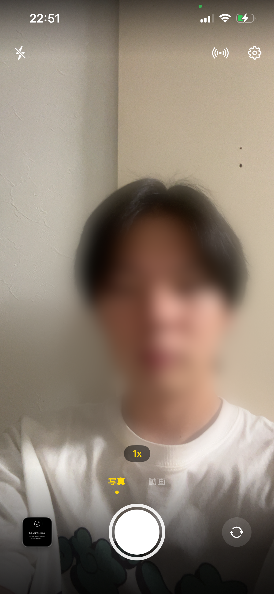
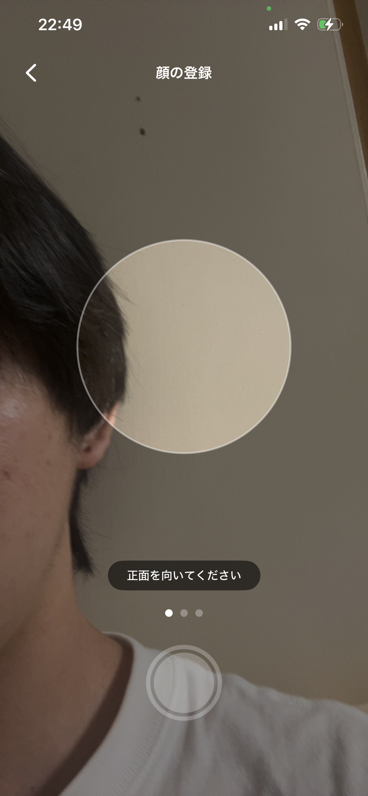
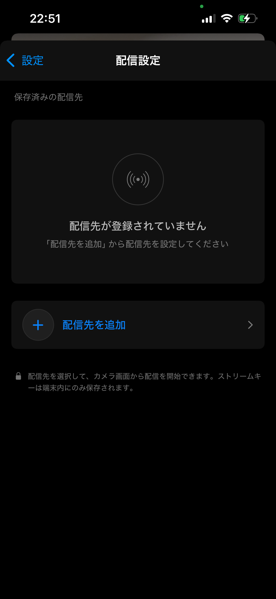
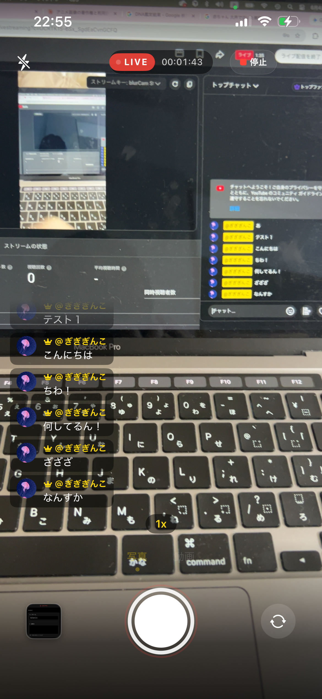
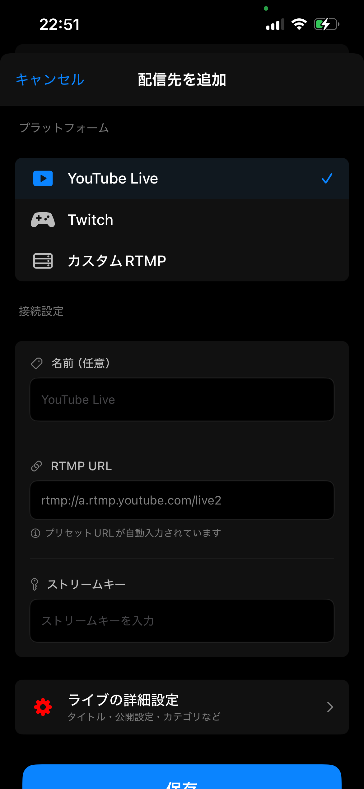
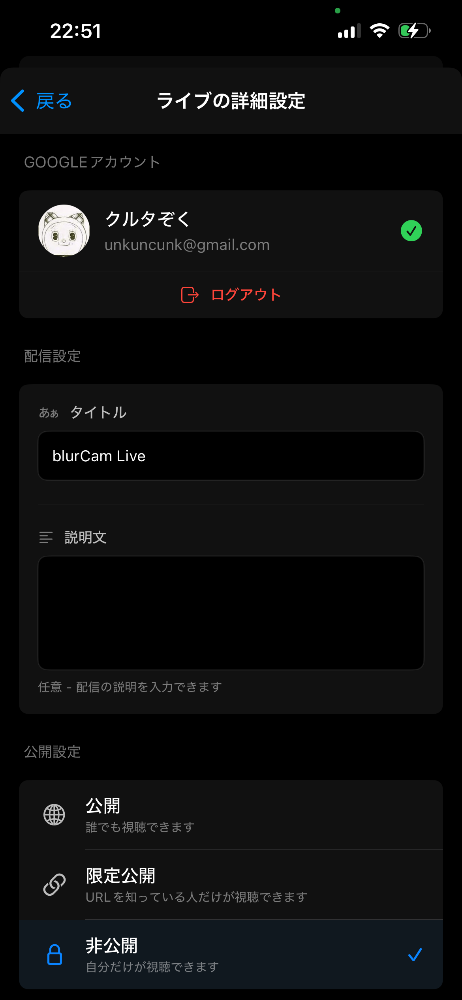
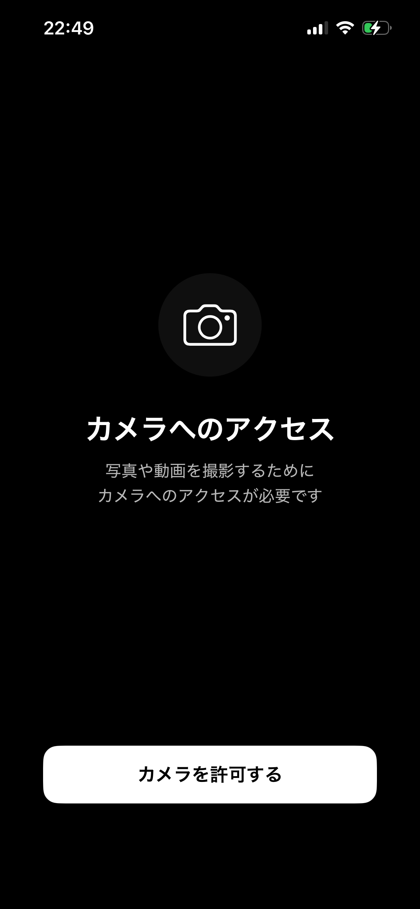
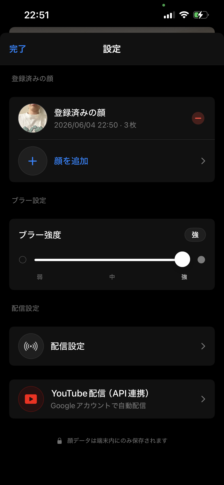
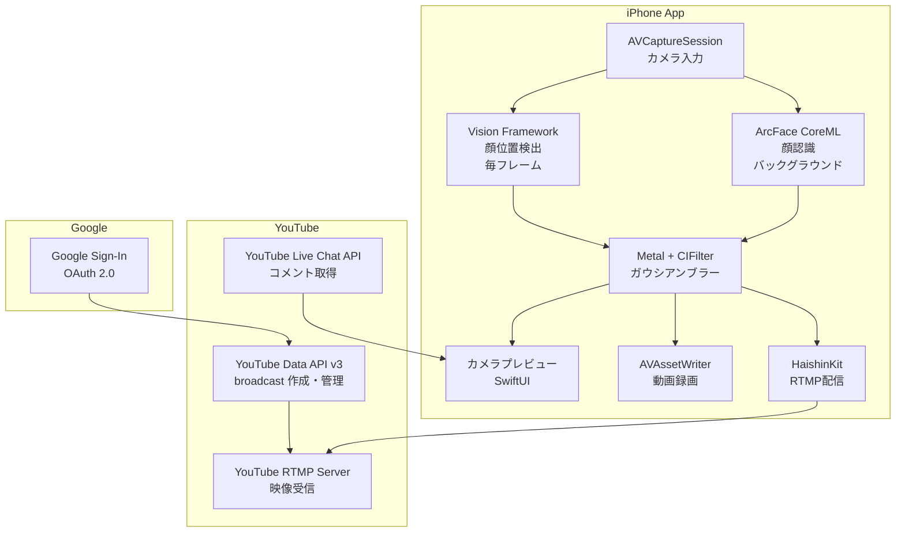
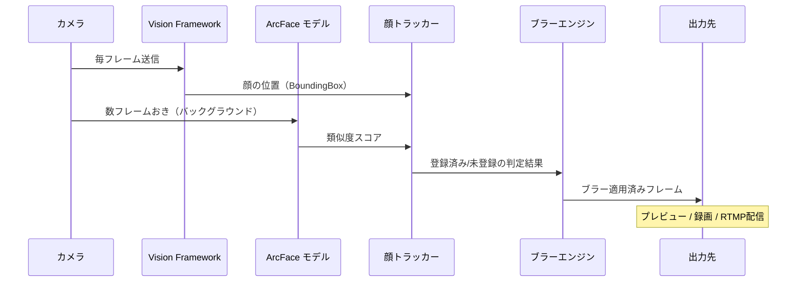

# blurCam

**登録した顔以外を自動でぼかすプライバシーカメラアプリ**

撮影・録画・YouTube ライブ配信に対応。登録した自分の顔はクリアに映り、それ以外の人物には自動でガウシアンブラーを適用します。

---

## スクリーンショット

<p align="center">
  
  
  
  
</p>

<p align="center">
  
  
  
  
</p>

---

## 特徴

- **リアルタイム顔ブラー** -- 登録していない人物の顔を自動でぼかす
- **顔登録** -- 正面・左・右の3枚で顔を登録。複数人の登録に対応
- **写真撮影** -- ブラー適用済みの写真を撮影
- **動画録画** -- ブラーが焼き込まれた動画を録画・保存
- **YouTube ライブ配信** -- RTMP でリアルタイム配信（手動ストリームキー / YouTube API 連携）
- **YouTube API 連携** -- Google ログインでタイトル・公開設定・カテゴリ等をアプリ内で設定
- **ライブチャット表示** -- 配信中に YouTube のコメントを TikTok ライブ風にオーバーレイ表示
- **カメラ切替** -- 配信中でもフロント/バックカメラを切り替え可能
- **ブラー強度調整** -- 弱・中・強の3段階

---

## システム構成図



### フレーム処理パイプライン



---

## 顔認識の仕組み

### 顔検出と顔認識の2段構え

| 処理 | フレームワーク | 実行頻度 | 役割 |
|---|---|---|---|
| **顔検出** | Vision Framework | 毎フレーム（30fps） | 顔の位置（BoundingBox）を取得 |
| **顔認識** | ArcFace CoreML | 数フレームおき（バックグラウンド） | 顔の特徴量を抽出し、登録済みの顔と比較 |

### ArcFace による顔認識

1. **顔登録時**: 正面・左・右の3方向から顔を撮影し、ArcFace モデル（w600k_mbf, 512次元）で特徴量（embedding）を抽出・保存
2. **撮影時**: 検出された顔の特徴量を抽出し、保存済みの特徴量とコサイン類似度で比較
3. **判定**: ヒステリシス付き閾値（登録: 0.55以上、解除: 0.25以下）で安定した判定を実現

### ブラー適用ロジック

```
新しい顔を検出
  -> 最初の10フレームはブラー（安全側に倒す）
  -> ArcFace で認識
    -> 登録済み -> ブラー解除（クリア表示）
    -> 未登録 -> ブラー継続
  -> 顔がフレームから消えた
    -> 8フレーム猶予（ちらつき防止）
    -> 完全に消えたらトラッカーから削除
```

### 安定化の工夫

- **1-Euro フィルター**: BoundingBox のスムージングでブラー領域のガタつきを抑制
- **テンポラルブレンド**: マスクのフレーム間ブレンド（alpha=0.6）で滑らかな遷移
- **適応的ブラー半径**: 顔サイズに応じてブラー半径を自動調整（遠い顔にも対応）

---

## 技術スタック

| カテゴリ | 技術 |
|---|---|
| 言語 | Swift |
| UI | SwiftUI |
| カメラ | AVFoundation |
| 顔検出 | Vision Framework |
| 顔認識 | ArcFace CoreML（w600k_mbf） |
| 画像処理 | Metal, Core Image |
| RTMP配信 | HaishinKit v1.9.9 |
| YouTube API | YouTube Data API v3, Google Sign-In SDK v8.0 |
| 動画録画 | AVAssetWriter |
| 対応OS | iOS 17.0+ |

---

## アーキテクチャ

**MVVM + Repository パターン**

```
Views/              -- SwiftUI ビュー
ViewModels/         -- ビューモデル（@Published でバインディング）
Models/             -- データモデル（Codable）
Services/           -- ビジネスロジック（カメラ・配信・顔認識）
Repositories/       -- データ永続化（UserDefaults）
```

### 主要なサービス

| サービス | 役割 |
|---|---|
| `CameraService` | AVCaptureSession の管理 |
| `VideoFrameProcessor` | フレーム処理パイプライン（検出 -> 認識 -> ブラー） |
| `FaceRecognitionService` | ArcFace モデルによる顔認識 |
| `BlurProcessingService` | Metal/CIFilter によるガウシアンブラー |
| `StreamingService` | HaishinKit RTMP 配信 |
| `YouTubeAPIService` | YouTube Data API v3 呼び出し |
| `GoogleAuthService` | Google OAuth 認証 |
| `YouTubeLiveChatService` | ライブチャットポーリング |

---

## セットアップ

### 必要な環境

- Xcode 16.4+
- iOS 17.0+ の実機（シミュレータではカメラが使用不可）
- Apple Developer アカウント

### ビルド手順

```bash
git clone https://github.com/RenyaMaruko/blurCam.git
cd blurCam
open blurCam.xcodeproj
```

Xcode でチームを設定し、実機にビルドしてください。

### YouTube API 連携（オプション）

YouTube ライブ配信の API 連携を使用する場合は追加設定が必要です。

1. [Google Cloud Console](https://console.cloud.google.com/) でプロジェクトを作成
2. YouTube Data API v3 を有効化
3. OAuth 2.0 クライアント ID（iOS）を作成
4. `Secrets.xcconfig` を作成:

```
// Secrets.xcconfig
GOOGLE_CLIENT_ID = your-client-id-here
```

詳細は [docs/google-signin-setup.md](docs/google-signin-setup.md) を参照してください。

> **Note**: YouTube API 連携なしでも、手動ストリームキーによる RTMP 配信は利用可能です。

